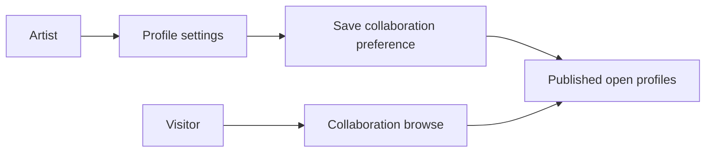
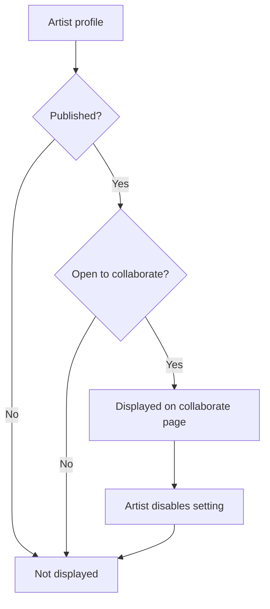

# SRS - C6 Collaboration Layer

## Status
- Owner: Tingxuan Dai
- Project: Lightsquare
- Group: C262T-4103
- Week 7 deliverable: C6 SRS section
- Implemented now: Open to Collaborate profile setting, `/collaborate` browse, workflow test
- Planned later: event collaborators, event registration, payment MVP

## 1. Purpose
The Collaboration Layer lets artists indicate that they are open to collaboration and lets visitors discover those artists. The current slice does not include messaging, applications, briefs, or team matching.

## 2. Actors
### Artist
An authenticated artist can enable or disable Open to collaborate on their own profile.

### Visitor
A visitor can open `/collaborate` and view eligible published artists.

## 3. Functional requirements
- **C6-FR-01:** An authenticated artist shall be able to set `open_to_collaborate` on their own profile.
- **C6-FR-02:** The setting shall persist after page refresh.
- **C6-FR-03:** The system shall provide a `/collaborate` browse page.
- **C6-FR-04:** Browse shall only show profiles where `published = true` and `open_to_collaborate = true`.
- **C6-FR-05:** Disabling the setting shall remove the artist from browse.
- **C6-FR-06:** Browse shall show display name, handle, category, bio when available, and collaboration status.
- **C6-FR-07:** If no eligible artists exist, the page shall show an empty state.

## 4. Data requirement
| Field | Type | Default | Purpose |
| --- | --- | --- | --- |
| `open_to_collaborate` | boolean | false | Controls collaboration discovery visibility |

Migration: `supabase/migrations/0013_open_to_collaborate.sql`

## 5. Current workflow
1. Artist signs in and opens `/dashboard/profile`.
2. Artist enables Open to collaborate and saves.
3. The value is stored on the artist profile.
4. A published artist with the setting enabled becomes eligible for `/collaborate`.
5. The browse page queries eligible profiles and displays artist cards.
6. If the artist disables the setting, the artist no longer appears.

## 6. Use-case diagram

## 7. Collaboration state flow

## 8. Access and privacy requirements
- **C6-AR-01:** An artist shall only update the collaboration preference on their own profile.
- **C6-AR-02:** Unpublished profiles shall not be exposed by the collaboration browse query.
- **C6-AR-03:** Profiles with Open to collaborate disabled shall not appear in browse.
- **C6-AR-04:** Browse shall use existing Supabase profile access/RLS rules.

## 9. Acceptance criteria
The current slice is accepted when:
1. A signed-in artist can enable the setting.
2. The value hemains after refresh.
3. A published open artist appears on `/collaborate`.
4. The artist disappears when the setting is disabled.
5. Artist cards and empty state render correctly.
6. Lint and TypeScript checks pass.
7. `npm run test:collaboration` passes.

## 10. Verification and traceability
| Requirement | Evidence | Status |
| --- | --- | --- |
| C6-FR-01/02 | `src/app/dashboard/profile/page.tsx` + save/refresh check | Verified |
| C6-FR-03/04/06/07 | `src/app/collaborate/page.tsx` | Implemented |
| C6-FR-05 | `tests/collaboration/01-open-to-collaborate-browse.spec.ts` | Passed |

Current automated result: 1 test file passed, 1 test passed.

## 11. Planned later C6 work
Not currently claimed as complete:
- event collaborators and joint editing
- non-collaborator/removed-collaborator access rejection
- free and paid event registration
- stub payment success/failure and retry
- payment settlement/access rules

## 12. Evidence summary
- `supabase/migrations/0013_open_to_collaborate.sql`
- `src/app/dashboard/profile/page.tsx`
- `src/app/collaborate/page.tsx`
- `tests/collaboration/01-open-to-collaborate-browse.spec.ts`
- `docs/QA_TEST_PLAN.md`
- `9e7cf69 test: cover open to collaborate browse workflow`
- `00ae735 docs: add W6 QA test plan structure`
